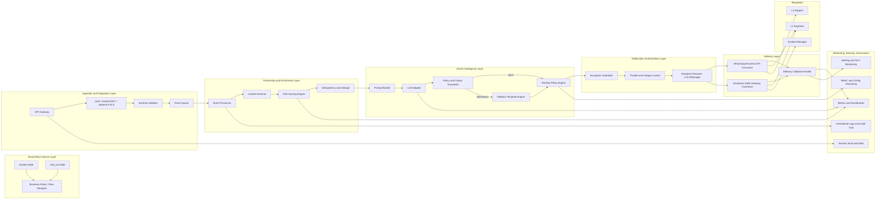
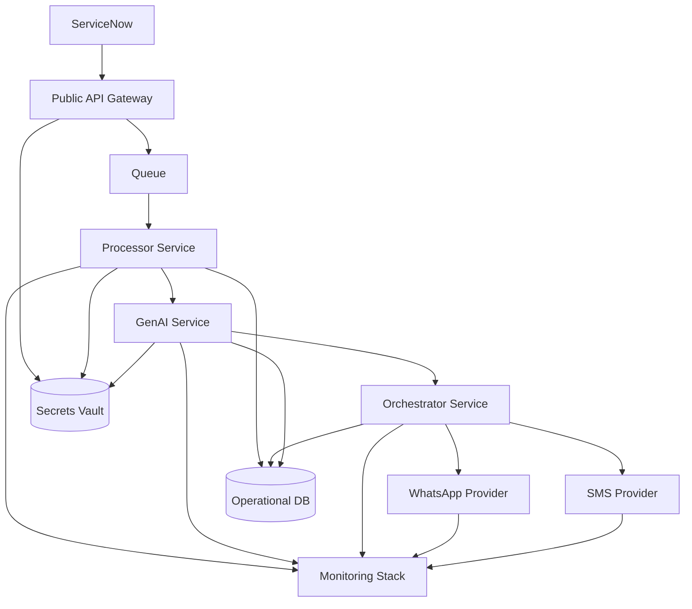

# Solution Architecture Diagram

This diagram represents the end-to-end architecture for the GenAI-Powered ServiceNow Alerts platform.

## 1. High-Level Architecture

## 2. Data and Control Notes

- Event flow is asynchronous after gateway validation to improve resilience.
- AI generation is guarded by policy checks with deterministic fallback.
- Routing and escalation are config-driven to avoid code redeploys for policy updates.
- Delivery status callbacks feed observability and escalation decisions.
- Security controls apply across all layers with encryption, RBAC, and auditability.

## 3. Optional Deployment View (MVP)

## 4. Suggested Use in Design Reviews

- Use section 1 in business and architecture walkthroughs.
- Use section 3 in infra and DevOps planning sessions.
- Pair this with the integration contract in `04_Integration_Design_ServiceNow.md` and technical details in `03_Technical_Design.md`.
